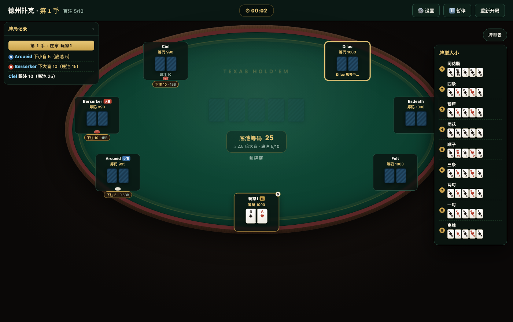
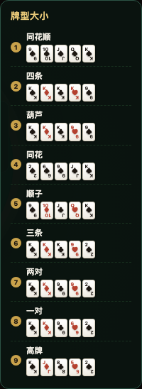
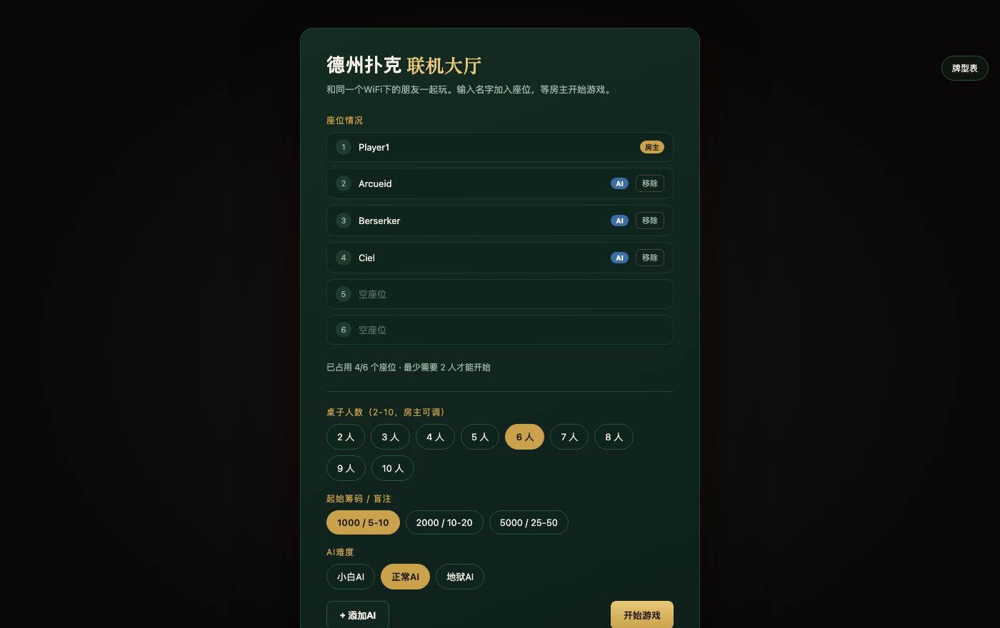
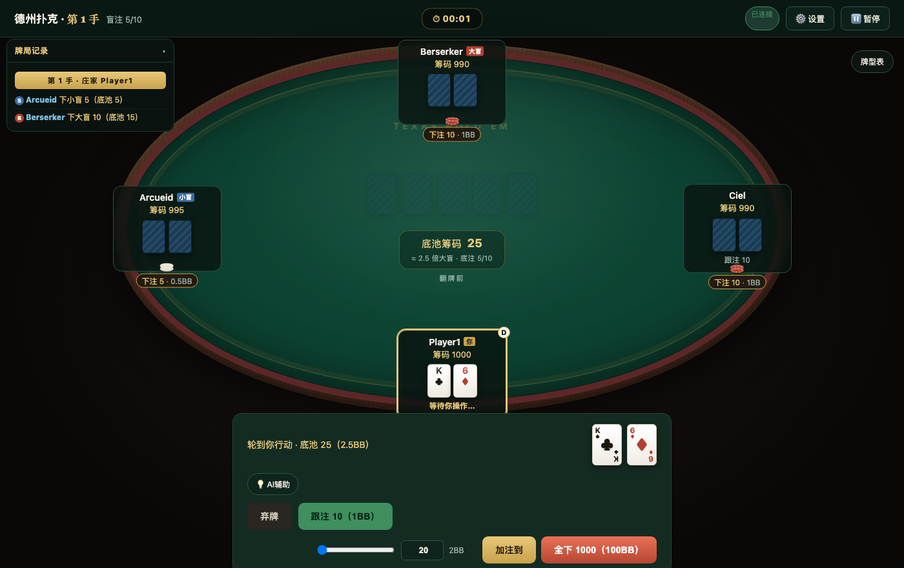

# 德州扑克 (Texas Hold'em)

一个零依赖、单文件实现的德州扑克网页游戏：内置三档智能 AI（蒙特卡洛模拟胜率 + 接近 GTO 的诈唬频率控制）、完整语音播报与音效、可安装的离线 PWA，以及一个独立的局域网联机版本（WebSocket 实时对战，最多 10 人同桌）。

**🎮 在线试玩：https://mezzopiano96.github.io/texas-holdem/**

<p align="center">
  
  
</p>

---

## 这是什么

德州扑克的规则本身不复杂，难的是把"看起来像真的""AI 不蠢""能在所有设备上跑"这几件事同时做好。这个项目从一个能打牌的最小实现开始，逐步加上了一整套围绕真实牌桌体验的细节：完整的边池计算、蒙特卡洛胜率估算驱动的 AI 决策、不会互相打断的语音播报队列、响应式椭圆牌桌（4K 大屏到手机小屏都不跑位），以及一个共享同一套牌型评估引擎、但走 WebSocket 协议的局域网联机版本。

整个单机版本是**一个 HTML 文件**——没有打包工具、没有框架、没有 `npm install`。打开文件或访问网址就能玩。联机版本是一个轻量 Node.js 服务器，依赖只有 `ws` 一个包。

## 功能

**核心玩法**
- 完整的德州扑克规则：边池（side pot）计算、全下、轮转庄家/盲注、多人摊牌比牌
- 2-9 人桌（单机），2-10 人桌（联机），可调起始筹码 / 盲注级别
- 单设备支持 1-2 名真人玩家：选 2 个座位时自动开启"同屏轮流隐私模式"，换人操作前需要手动确认身份，避免互相看到对方手牌

**AI 对手**
- 三档可切换难度：
  - **小白 AI** — 蒙特卡洛迭代次数少、胜率估算粗糙，几乎不弃牌（calling station），适合新手练习
  - **正常 AI** — 胜率 + 底池赔率混合策略，按"价值下注 / 偶尔纯诈唬 / 半诈唬"分层决策，每个 AI 有独立的随机攻击性参数
  - **地狱 AI** — 迭代次数提升 3-5 倍以获得更准确的胜率估算；下注尺寸是胜率的连续函数而非粗档随机数；诈唬频率跟下注尺寸挂钩，按"让对手跟注/弃牌都接近无差别"的思路控制（简化版 GTO 平衡思路），而不是固定百分比
- 可选的"AI 辅助"提示面板：基于蒙特卡洛模拟实时估算当前玩家的胜率，给出具体的下注尺寸建议——计算只使用这名玩家自己能看到的公开信息（自己的手牌 + 已翻出的公共牌），不会用到任何对手的隐藏信息

**沉浸感**
- 真实语音播报（预生成的 TTS 音频，而非浏览器内置合成语音），男声/女声可选，每个 AI 玩家有独立的音高偏移，同性别角色听感也不同；语音播放走队列，绝不会两段声音叠在一起抢话
- Web Audio API 实时合成的音效与背景音乐（无需任何外部音频文件）
- 下注会渲染成真实的彩色筹码堆叠图形，真人玩家自己下注时还有"推筹码"滑动动画
- 牌桌做成正统德州桌的椭圆造型：木纹外缘 + 绒垫包边 + 双层赛道金线，座位用"等弧长"算法分布，人数再多也不会在桌边扎堆

**适配与无障碍**
- 完整中 / 英 / 日三语界面，运行中随时切换，所有动态内容（日志、牌型表、AI 提示）都会跟着重新翻译
- 响应式布局：同一套代码在 4K 显示器和手机竖屏上都经过实测，牌桌尺寸由 JS 实时计算以填满可用空间
- PWA：可安装到主屏幕，Service Worker 离线缓存，支持 iOS/Android/桌面
- PWA 更新策略：页面导航优先获取新版，离线时回退到缓存；图标、语音等静态资源缓存优先

**局域网联机**
- 一台设备起 Node 服务器当主机，其他人用浏览器连同一个 WiFi 即可加入，无需安装任何 App
- 房主可在大厅随时增减 AI 座位、调整桌子人数/筹码/AI 难度
- 断线自动重连（`sessionStorage` 令牌），真人超时不操作自动弃牌/过牌，不会卡住整桌；座位号与引擎下标双向映射，开局前有空座位也能正确认回原座位
- 服务器是唯一的权威状态源，每个连接只会收到自己能看到的手牌——物理上不存在"偷看对方手牌"的可能
- 服务端会校验玩家行动类型与下注范围；客户端和日志渲染会转义玩家输入，避免名字污染页面

## 技术栈与实现细节

| 方面 | 实现方式 |
|---|---|
| 核心引擎 | 原生 JavaScript，零依赖；7 张牌找最佳 5 张组合的标准做法（C(7,5)=21 种组合逐一评分取最大） |
| AI 决策 | 蒙特卡洛模拟：对未知牌随机抽样上千次，统计胜率；下注尺寸/诈唬频率由胜率与底池赔率的差值（EV margin）驱动，叠加随机噪声防止决策被预测 |
| 牌桌几何 | 椭圆周长的"等弧长"分布算法（数值积分累积弧长表 + 二分查找反解角度），解决了扁椭圆下用等角度分布导致座位在长轴两端堆挤的问题 |
| 音频 | Web Audio API：`AudioBufferSourceNode` 播放预生成语音（Edge TTS 离线生成），振荡器实时合成音效/BGM；语音播放用状态机做队列管理，避免竞态导致的声音重叠 |
| 联机协议 | WebSocket，服务器持有唯一权威的游戏状态机；座位号（持久、可能有空隙）与引擎内部下标（压缩、连续）之间维护双向翻译映射；玩家行动会在服务端规范化并 clamp 到合法范围；每个客户端收到为其定制的状态快照（自己的手牌可见，其他人的不可见） |
| 国际化 | 运行时语言切换，日志采用"存结构化数据、渲染时按当前语言格式化"的设计，因此切换语言会连历史记录一起重新翻译，而不是只对新内容生效 |
| PWA | `manifest.json` + Service Worker；HTML/导航走 network-first，离线时回退缓存，静态资源走 cache-first，图标走 `sips` 批量生成多尺寸 |
| 测试 | 联机版使用 Node 内置 `node:test` 覆盖牌型评估、A2345 顺子、边池分层、稀疏座位映射、行动校验与静态路径防穿越；`npm test` 还会检查单机/联机两份语音资源是否同步 |

## 快速开始

**单机版**：直接打开 [在线 Demo](https://mezzopiano96.github.io/texas-holdem/)，或者把 `texas-holdem.html` 下载到本地用浏览器打开——不需要任何安装步骤。

**联机版**（局域网内和朋友一起玩）：

```bash
cd multiplayer
npm install        # 只有一个依赖：ws
npm start          # 启动后会打印局域网内的访问地址
```

联机版测试：

```bash
cd multiplayer
npm test
```

终端会打印出类似 `http://192.168.x.x:3000/` 的地址，让同一个 WiFi 下的所有人用手机/电脑浏览器打开即可加入。完整的图文操作手册见 [`multiplayer/README.md`](multiplayer/README.md)（面向完全没用过命令行的人写的）。

<p align="center">
  
  
</p>

## 项目结构

```
texas-holdem.html       单机版：完整游戏（引擎 + AI + UI + 语音 + 音效）单文件实现
manifest.json / service-worker.js / icon-*.png   PWA 相关资源
index.html              根路径重定向到 texas-holdem.html

multiplayer/
  engine.js             纯逻辑引擎（牌型评估 + 游戏状态机 + AI 决策），不依赖浏览器全局对象，可在 Node 里跑
  server.js             HTTP 静态文件服务 + WebSocket 游戏服务器，大厅状态机、断线重连、超时处理
  public/client.html    联机客户端：大厅 UI + 牌桌渲染，数据完全来自服务器推送
  test/                 Node 内置测试：规则、边池、服务端协议辅助函数
  README.md             联机版操作手册（给非技术用户看的图文教程）
scripts/
  check-voice-assets.js  检查单机/联机语音资源文件名和内容是否一致
```

`engine.js` 是从 `texas-holdem.html` 里的纯逻辑部分复制出来单独维护的——故意不做成共享模块，这样修改/部署单机版永远不会有风险影响到已经在跑的联机服务器，反之亦然。

## 这个项目展示了什么

- **算法**：蒙特卡洛方法做不确定性下的决策估算；扑克牌型评估与边池分配的组合数学；椭圆几何上的弧长积分与数值反解
- **实时系统**：WebSocket 双向通信、服务器权威状态、断线重连、超时容错、并发操作的来源校验与服务端行动校验（防止串座位/非法下注）
- **音频编程**：Web Audio API 从振荡器/缓冲区到效果链的底层操作，状态机式的播放队列管理
- **前端工程**：零框架的响应式 UI、运行时国际化、PWA 离线能力、跨极端分辨率（4K 到手机）的自适应布局
- **产品打磨**：从"能跑"到"好用"——隐私保护机制、无障碍语言切换、AI 难度分层、暂停/重连等边界情况的处理

## 已知限制

- 联机版目前只有中文界面，国际化还没有同步过去
- 单进程只支持一桌牌局，打完一局要重启服务器才能开新桌（够几个朋友凑一桌用，没做成大厅列表系统）
- 没有账号系统/筹码持久化——刷新页面手动重连能保住当前进度，但关掉服务器进程后牌局数据不会保留

## 许可

个人学习/作品展示项目，欢迎参考代码，请勿用于真实货币博彩用途。
